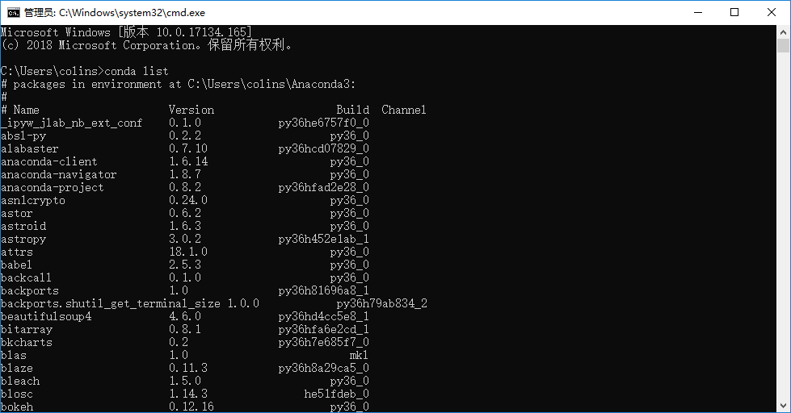

# 2.1 环境配置

## 一、 下载Anaconda安装包：

下载地址：[https://www.anaconda.com/download/](https://www.anaconda.com/download/)

根据所使用操作系统选择对应版本的Anaconda

## 二、 下载PyCharm安装包：

下载地址：[http://www.jetbrains.com/pycharm/download/](http://www.jetbrains.com/pycharm/download/)

 选择对应操作系统的Professional版安装包

## 三、 下载完成后开始安装：

Anaconda安装： 

进入安装界面，点击Next按钮： 

同意使用条款，点击I Agree按钮： 

选择仅为当前用户安装，以便在后续配置PyCharm中为Python环境选择路径，点击Next按钮： 

选择安装路径，建议使用默认路径，点击Next按钮： 

在选择额外安装选项的页面建议勾选“将Anaconda添加到我的PATH环境变量”以及“注册Anaconda作为我的默认Python3环境”，点击Install按钮： 

在完成安装后，会有如下提示，Skip完成安装：

PyCharm安装： 

进入安装界面，点击Next按钮： 

建议选择默认安装路径，点击Next按钮： 

选择添加到桌面的快捷方式，点击Next按钮： 

添加到开始菜单，选择Install： 

安装完成，点击Finish按钮。

## 四、 环境配置检测：

1. 安装完成后，在命令行中启用Python解释器，有如下提示则表示Anaconda环境配置完成：

2. 测试conda管理环境：在控制台输入命令`conda list`查看是否出现下面的结果：

## 五、 编译器内环境配置：

检测环境通过后，使用PyCharm配置编译器内Python环境：

打开PyCharm，选择不导入设置文件： 

阅读完使用条款后，点击Accept按钮： 

选择不分享使用数据： 

选择Evaluate for free： 

同意注册条款： 

选择界面主题，点击Next按钮： 

默认不选择插件，点击Start按钮： 

进入界面： 

进入设置界面： 

选择Project Interpreter，点击Add按钮: 

选择Virtualenv Environment-Exsisting environment-Select Python Interpreter，并选择“Anaconda的安装路径\python.exe”，点击OK按钮： 

在正确完成环境配置后，会显示如下界面，点击OK保存更改： 

至此，PyCharm的Python环境配置完成。

